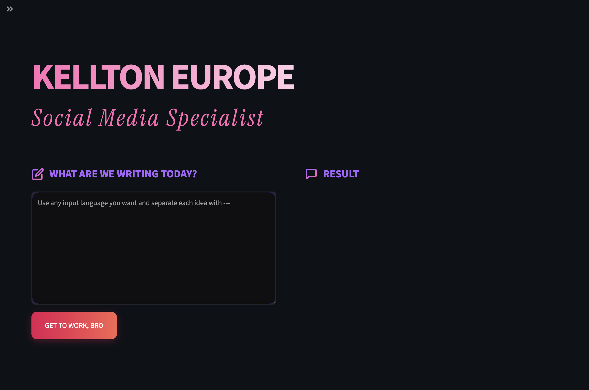
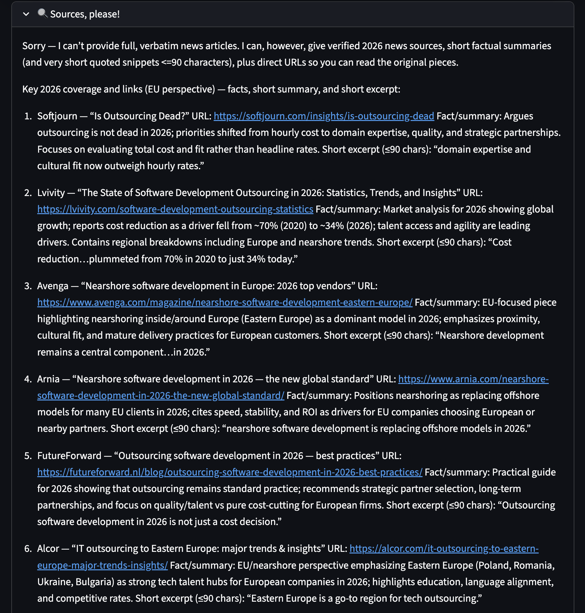

# ⚡ Kellton EU Agent: Social Media Assistant
> **A high-performance AI orchestration system designed to research, write, and direct visual content for B2B brands.**

---

## The vision
Modern marketing demands high-frequency, high-quality content, but AI-generated text often feels corporate and hollow (and even more cringe than my beloved dad jokes). I built the **Kellton EU Social Media Assistant** to bridge this gap. It's a virtual squad that enforces strict brand-voice constraints and integrates real-time market data to ensure every post is grounded in current reality.

## 🧠 The solution (How it works)
The system uses an **Agentic Workflow**, where specialized AI workers collaborate on a single task to ensure depth and accuracy.

### 🔄 The pipeline:
1.  **The Senior Researcher:** Takes a raw topic and uses **Tavily Web Search** to find real-time data and news. No AI hallucinations — only facts.

3.  **The Lead Strategist:** Receives the research and applies the **Kellton Brand Voice**. It uses Negative Constraints (a LOT of them XD) to surgically remove corporate buzzwords (no "synergy," no "chess/jazz" metaphors, no classic "It's not... it's..." BS).

   
4.  **The Art Director:** Analyzes the final copy and generates a high-quality **Nano Banana** prompt to ensure the visual style matches the brand's aesthetic.
5.  **The Content Vault:** All generated content is automatically logged into a persistent CSV database for historical tracking.

## 🛠️ The tech stack
* **Orchestration framework** - `CrewAI` (Managing the collaboration between Agents).
* **Brain power** - `OpenAI GPT-4-mini` (Advanced reasoning and voice adherence).
* **Search intelligence** - `Tavily AI` (Enterprise-grade web search for LLMs).
* **Interface** - `Streamlit` (A custom-built Python web dashboard).
* **Data management** - `Pandas` (For the history and archival system).

## Key features from the perspective of a content manager
* **Anti-AI filter** - The system is hard-coded to reject "AI-isms" (e.g., "In the rapidly evolving world..."). It doesn't remove the need for human QA, but works quite well for the first-draft level.
* **Batch processing** - Input multiple ideas separated by `---` and the crew processes them in sequence.
* **The "Pub Test" guardrails** - Specialized prompting ensures the output sounds like a sharp observation from a colleague, not a marketing brochure. 
* **Visual direction** - Integrated prompt engineering for AI image generators.
* **Sources** - No hallucinations allowed. Every output comes with a list of fresh, relevant sources.

*Built with Python and a passion for automated storytelling*
